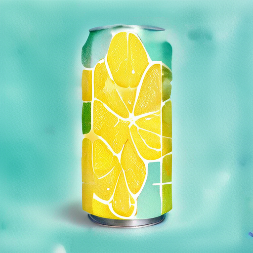

# amused/amused-512

This is an implementation of the [amused/amused-512](https://huggingface.co/amused/amused-512) as a Cog model. [Cog packages machine learning models as standard containers.](https://github.com/replicate/cog)

First, download the pre-trained weights:

    cog run script/download-weights

Then, you can run predictions:

    cog predict -i prompt="a photo of a colorful lemon mocktail can with mint leaves with an abstract background"

## Example:

"a photo of a colorful lemon mocktail can with mint leaves with an abstract background"

